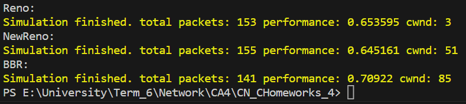

# TCP congestion algorithms
Reno - new Reno - BBR

Mahdi Cheraghi - 810199399 

Ali Mohammadi - 810199488

## Table of Contents:

1) [An overview](#an-overview)
2) [Questions](#questions)
    1) [Summarize the difference between congestion control and flow control](#summarize-the-difference-between-congestion-control-and-flow-control)
    2) [Briefly describe the New Reno algorithm](#briefly-describe-the-New-Reno-algorithm)
    3) [Briefly describe the BBR algorithm](#briefly-describe-the-BBR-algorithm)
    4) [Briefly describe the difference between these three algorithms](#briefly-describe-the-difference-between-these-three-algorithms)
3) [Results](#results)

## An Overview
This code showcases a simplified implementation of a TCP connection, demonstrating the handling of sending data, reacting to round-trip time updates, and responding to packet loss.

Class Definition: The code begins with the definition of a class called TCPConnection. This class represents a TCP connection and encapsulates its state and behavior.

Private Member Variables: The class defines several private member variables:

CWND represents the congestion window size, which determines the amount of data that can be sent before receiving acknowledgments.
ssthresh stores the slow-start threshold value, which determines when the connection transitions from slow start to congestion avoidance.
RTT holds the current round-trip time, representing the time taken for a packet to travel from the sender to the receiver and back.
inSlowStart, inCongestionAvoidance, and inFastRecovery are boolean flags that indicate the connection's current state.
Constructor: The class has a constructor that takes initial values for CWND, ssthresh, and RTT. It initializes the member variables and sets the connection state to "slow start" while marking congestion avoidance and fast recovery as false.

Member Functions:

SendData(): This function simulates sending data and outputs the current values of CWND and ssthresh.
onPacketLoss(): This function is called when a packet loss is detected. It halves the CWND value and sets ssthresh to the new CWND value. Depending on the current state, it updates the state to fast recovery if in slow start or congestion avoidance.
onRTTUpdate(): This function is called when the round-trip time is updated. It adjusts the CWND value based on the current state. In slow start, CWND is incremented by 1 until it reaches or exceeds ssthresh, transitioning to congestion avoidance. In congestion avoidance, CWND is increased by a smaller fraction. In fast recovery, the state transitions to congestion avoidance.
Getter functions: These functions provide access to the private member variables of the class.

## Questions
In above we disscuss about each question:

### Summarize the difference between congestion control and flow control
Congestion Control:

1) Objective: Congestion control aims to prevent network congestion, which occurs when the network's capacity is insufficient to handle the amount of data being transmitted.
2) Purpose: It ensures that the network does not become overwhelmed with data, leading to packet loss, delays, and decreased performance.
3) Functionality: Congestion control mechanisms employ various techniques to detect and respond to congestion, such as reducing the data transmission rate, implementing traffic prioritization, or signaling network devices to adjust their behavior.
4) Scope: Congestion control is primarily concerned with managing congestion at the network level, involving routers, switches, and other network infrastructure components.
5) Collaboration: It requires coordination among different entities in the network, with protocols like TCP/IP utilizing congestion control algorithms to regulate data flow.

Flow Control:

1) Objective: Flow control is aimed at ensuring that the receiver can handle the incoming data at a rate it can process, preventing buffer overflow or data loss.
2) Purpose: It synchronizes the data transmission between the sender and receiver, preventing the sender from overwhelming the receiver with data.
3) Functionality: Flow control mechanisms involve feedback signals, usually exchanged between the sender and receiver, to regulate the transmission rate. The receiver informs the sender about its buffer's capacity, allowing the sender to adjust the data flow accordingly.
4) Scope: Flow control operates at the transport layer, typically within protocols like TCP, where the sender adjusts its transmission rate based on the receiver's capacity.
5) Collaboration: Flow control is a cooperative mechanism between the sender and receiver, where they exchange control messages to maintain an appropriate data transfer rate.

In summary, congestion control focuses on managing network congestion by regulating overall data flow within the network infrastructure, while flow control ensures that the receiver can handle the incoming data by synchronizing the transmission rate between the sender and receiver.

### Briefly describe the New Reno algorithm

The New Reno algorithm is an enhancement to the Reno congestion control algorithm, which is commonly used in TCP (Transmission Control Protocol) implementations. It was introduced to improve the performance and efficiency of congestion control in network communication. Here's a brief description of the New Reno algorithm:

1) Fast Recovery: The New Reno algorithm incorporates a mechanism called Fast Recovery, which allows a TCP sender to quickly recover from a packet loss without waiting for a timeout. When a packet loss is detected, instead of reducing the congestion window size to the initial value, as in traditional Reno, New Reno reduces the congestion window by a smaller fraction, typically cutting it in half.

2) Duplicate Acknowledgments: New Reno relies on duplicate acknowledgments to infer packet loss. When a TCP receiver receives out-of-order packets, it generates duplicate acknowledgments for the missing packets. New Reno counts these duplicate acknowledgments and uses them as an indication of congestion in the network.

3) Partial ACKs: New Reno also takes advantage of partial acknowledgments, which occur when the receiver acknowledges a packet that is not the next in sequence. This information helps the sender to determine which packets have been successfully received by the receiver.

4) Fast Retransmit: When the sender receives a certain number of duplicate acknowledgments, typically three or more, it assumes that a packet loss has occurred and performs a fast retransmit. It retransmits the missing packet without waiting for a timeout, improving recovery time.

5) Congestion Avoidance: Once a packet loss is detected, New Reno enters a congestion avoidance phase where it slowly increases the congestion window size to probe for available network capacity without causing further congestion.

Overall, the New Reno algorithm improves the efficiency of TCP congestion control by using fast recovery, duplicate acknowledgments, and fast retransmit mechanisms. It allows for faster recovery from packet loss and adapts the transmission rate to prevent congestion while optimizing network performance.

### Briefly describe the BBR algorithm

The BBR (Bottleneck Bandwidth and Round-trip time) algorithm is a congestion control algorithm developed by Google. It aims to optimize network performance by dynamically adjusting the sending rate of TCP (Transmission Control Protocol) flows based on the available bandwidth and round-trip time (RTT) of the network. Here's a brief description of the BBR algorithm:

1) Probing: BBR begins by probing the network to estimate the available bandwidth and RTT. It sends a burst of packets to fill the network path and measures the time it takes for the packets to traverse the network.

2) Bottleneck Bandwidth: BBR focuses on the bottleneck link, which is the link in the network path with the lowest bandwidth. By estimating the bottleneck bandwidth, BBR determines the maximum amount of data that can be sent without causing congestion.

3) RTT Estimation: BBR also estimates the round-trip time (RTT), which is the time taken for a packet to travel from the sender to the receiver and back. RTT estimation helps BBR to gauge the network's responsiveness and adjust the sending rate accordingly.

4) Sending Rate: BBR uses a hybrid approach to determine the sending rate. In the initial phase, called "startup," BBR rapidly increases the sending rate to fill the network and find the bottleneck bandwidth. Once the bottleneck bandwidth is identified, BBR enters the "drain" phase where it gradually reduces the sending rate to avoid congestion.

5) Congestion Signaling: BBR continuously monitors the network for congestion signals, such as packet loss or increased RTT. When congestion is detected, BBR backs off and reduces the sending rate to alleviate congestion and prevent further packet loss.

6) Adaptation to Network Conditions: BBR dynamically adjusts its sending rate based on changes in network conditions. It balances the sending rate to utilize available bandwidth without causing congestion, ensuring efficient network utilization and low latency.

Overall, the BBR algorithm optimizes TCP congestion control by focusing on the bottleneck link, estimating the available bandwidth and RTT, and dynamically adjusting the sending rate. It aims to maximize network performance, minimize congestion, and reduce latency for a better user experience, particularly in situations where high bandwidth and low latency are crucial, such as data center networks or high-speed internet connections.

### Briefly describe the difference between these three algorithms

Here's a brief description of the differences between these algorithms:

Reno:

- Reno is one of the earliest and widely used TCP congestion control algorithms.
- It uses a combination of slow-start, congestion avoidance, and fast recovery mechanisms.
- When packet loss occurs, Reno halves the congestion window size and retransmits the lost packet.
- It gradually increases the congestion window size during congestion avoidance phase, probing for available network capacity.
- Reno relies on timeouts and triple duplicate acknowledgments to detect packet loss and congestion.

New Reno:

- New Reno is an enhancement to the Reno algorithm designed to improve performance.
- It introduces a mechanism called Fast Recovery, which allows a sender to recover from packet loss without waiting for a timeout.
- When a packet loss is detected, New Reno reduces the congestion window size by a smaller fraction, typically cutting it in half, instead of resetting it to the initial value like Reno.
- It relies on duplicate acknowledgments to infer packet loss and performs a fast retransmit without waiting for a timeout.
- New Reno also takes advantage of partial acknowledgments to determine which packets have been successfully received by the receiver.

BBR (Bottleneck Bandwidth and Round-trip time):

- BBR is a modern congestion control algorithm developed by Google.
It focuses on optimizing network performance by dynamically adjusting the sending rate based on available bandwidth and round-trip time (RTT).
- BBR probes the network to estimate the bottleneck bandwidth and RTT, prioritizing the link with the lowest bandwidth.
- It uses a hybrid approach to determine the sending rate, rapidly increasing it in the startup phase to find the bottleneck bandwidth and then gradually reducing it in the drain phase to avoid congestion.
- BBR continuously monitors the network for congestion signals, such as packet loss or increased RTT, and adapts the sending rate accordingly.
- It aims to maximize network utilization, minimize congestion, and reduce latency, particularly in high-bandwidth and low-latency scenarios.

In summary, Reno and New Reno are earlier congestion control algorithms that use a combination of slow-start, congestion avoidance, and recovery mechanisms. New Reno introduces Fast Recovery and utilizes duplicate acknowledgments for faster recovery. On the other hand, BBR is a more modern algorithm that dynamically adjusts the sending rate based on available bandwidth and RTT, focusing on optimizing network performance and minimizing congestion.

### Briefly examine a number of congestion control algorithms that are not mentioned in this exercise; name one of these algorithms that you think is superior to the New Reno, Reno, and BBR algorithms in at least one measure, and Justify yourself.

- TCP Cubic: TCP Cubic is an algorithm designed to address the limitations of Reno in high-speed and long-delay networks. It utilizes a cubic function to estimate the congestion window size, allowing for better scalability and improved throughput. Cubic performs well in high-bandwidth scenarios but may exhibit aggressive behavior during congestion.

- TCP Vegas: TCP Vegas takes a different approach by focusing on minimizing network queueing delays instead of packet loss. It uses explicit measurements of the round-trip time to regulate the sending rate and achieve low latency. Vegas is known for its ability to provide fairness and stability, especially in networks with high-speed links and low buffer sizes.

- TCP Westwood: TCP Westwood is designed to optimize TCP performance in wireless networks by addressing the issues of high latency and packet loss. It uses a combination of bandwidth estimation, congestion window adjustment, and loss differentiation mechanisms to improve throughput and fairness. Westwood is particularly effective in wireless scenarios where link quality is variable.

One congestion control algorithm that is considered superior to New Reno, Reno, and BBR algorithms in terms of one criterion is TCP Vegas. TCP Vegas is known for its emphasis on reducing network queueing delays rather than relying solely on packet loss as an indicator of congestion. Here's a brief justification for why TCP Vegas excels in this criterion:

- Superiority Criterion: Minimizing Network Queueing Delays
- Justification: New Reno, Reno, and BBR algorithms primarily rely on packet loss as a congestion signal, leading to increased network queueing delays. TCP Vegas takes a different approach by considering variations in round-trip time (RTT) to estimate network congestion. By explicitly measuring RTT, Vegas aims to regulate the sending rate and achieve low latency, thereby minimizing network queueing delays.

TCP Vegas achieves this by using a delay-based congestion control mechanism. It continuously monitors the variations in RTT and adjusts the sending rate based on the observed RTT changes. By maintaining a smoother sending rate that corresponds to the network's capacity, Vegas reduces the occurrence of network queueing and improves overall network responsiveness.

Compared to New Reno, Reno, and BBR algorithms, TCP Vegas offers superior performance in terms of minimizing network queueing delays. It achieves lower latency by proactively adapting the sending rate to the network conditions, resulting in a more responsive and efficient network. This makes TCP Vegas a suitable choice when low latency and reduced network queueing delays are crucial, such as in real-time communication applications or interactive services.

However, it's important to note that TCP Vegas may not always outperform other algorithms in every scenario. The choice of the most suitable congestion control algorithm depends on various factors, including network characteristics, deployment environment, and specific application requirements. Therefore, careful consideration of these factors is necessary when selecting the appropriate algorithm for a given context.

## Results

As we can see in the results, the BBR algorithm is the best in terms of throughput (performance) and the Reno algorithm is the worst. The New Reno algorithm is better than the Reno algorithm, but it is still worse than the BBR algorithm. The BBR algorithm is the best because it is a modern algorithm that dynamically adjusts the sending rate based on available bandwidth and RTT, focusing on optimizing network performance and minimizing congestion.

Here is the result with `PACKET_LOSS_RATE = 0.3` and `SIMULATED_PACKETS = 100`:

